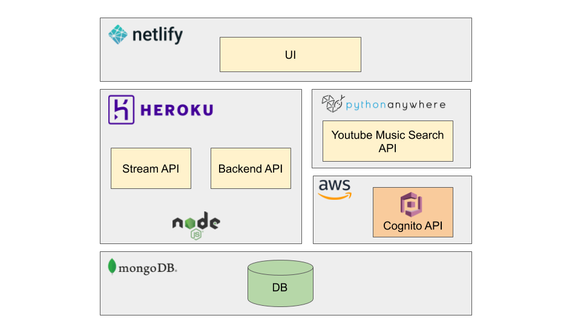

# BackTube

[BackTube](https://backtube.app) is a streaming app for music lovers who can create and follow playlists of their favorite songs from Youtube or Bandcamp.

There are 4 different repositories:
- UI (this repository)
- [Backend API](https://github.com/chaos87/backtube-backend-api)
- [Stream API](https://github.com/chaos87/backtube-stream-api)
- [Youtube Music Search API](https://github.com/chaos87/backtube-ytmusic-api)

# Architecture



## Installation

Use the package manager [npm](https://www.npmjs.com/get-npm) to install the UI.

```bash
npm install
```

## Usage

```bash
npm start
```

## Dependencies

- [Material UI](https://material-ui.com/)
- [React Music Player](https://github.com/lijinke666/react-music-player)
- [Material UI Search Bar](https://github.com/TeamWertarbyte/material-ui-search-bar)
- [React Modal Video](https://github.com/appleple/react-modal-video/blob/master/readme.md)
- [React Router Modal Gallery](https://github.com/onderonur/react-router-modal-gallery)
- [React Router Last Location](https://github.com/hinok/react-router-last-location)
- [React Redux](https://react-redux.js.org/)
- [Redux Persist](https://github.com/rt2zz/redux-persist)


## Contributing
Please open an issue prior to submitting a pull request, so that we can discuss whether it makes sense to be implemented or not.
Feature ideas or bug reports are more than welcome!

## License
[MIT](https://choosealicense.com/licenses/mit/)
